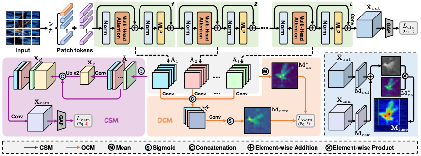

# Category-aware Allocation Transformer for Weakly Supervised Object Localization (ICCV 2023)

PyTorch implementation of ''Category-aware Allocation Transformer for Weakly Supervised Object Localization''. 

## 📋 Table of content
 1. [📎 Paper Link](#1)
 2. [💡 Abstract](#2)
 3. [📖 Method](#3)
 4. [📃 Requirements](#4)
 5. [✏️ Usage](#5)
    1. [Start](#51)
    2. [Prepare Datasets](#52)
    2. [Model Zoo](#53)
    3. [Training](#54)
    4. [Inference](#55)
 6. [🔍 Citation](#6)
 7. [❤️ Acknowledgement](#7)

## 📎 Paper Link <a name="1"></a> 
> Category-aware Allocation Transformer for Weakly Supervised Object Localization ([link](https://openaccess.thecvf.com/content/ICCV2023/papers/Chen_Category-aware_Allocation_Transformer_for_Weakly_Supervised_Object_Localization_ICCV_2023_paper.pdf))
* Authors: Zhiwei Chen, Jinren Ding, Liujuan Cao, Yunhang Shen, Shengchuan Zhang, Guannan Jiang, Rongrong Ji
* Institution: Xiamen University, Xiamen, China. Tencent Youtu Lab, Shanghai, China. CATL, China

## 💡 Abstract <a name="2"></a> 
Weakly supervised object localization (WSOL) aims to localize objects based on only image-level labels as supervision. Recently, transformers have been introduced into WSOL, yielding impressive results. The self-attention mechanism and multilayer perceptron structure in transformers preserve long-range feature dependency, facilitating complete localization of the full object extent. However, current transformer-based methods predict bounding boxes using category-agnostic attention maps, which may lead to confused and noisy object localization. To address this issue, we propose a novel Category-aware Allocation TRansformer (CATR) that learns category-aware representations for specific objects and produces corresponding category-aware attention maps for object localization. First, we introduce a Category-aware Stimulation Module (CSM) to induce learnable category biases for self-attention maps, providing auxiliary supervision to guide the learning of more effective transformer representations. Second, we design an Object Constraint Module (OCM) to refine the object regions for the category-aware attention maps in a self-supervised manner. Extensive experiments on the CUB-200-2011 and ILSVRC datasets demonstrate that the proposed CATR achieves significant and consistent performance improvements over competing approaches.

## 📖 Method <a name="3"></a> 

<p align="center">
     <br />
    <em> 
    </em>
</p>
The architecture of the proposed CATR. It consists of a vision transformer backbone, a category-aware stimulation module (CSM), and an object constraint module (OCM).

## 📃 Requirements <a name="4"></a> 
  - PyTorch==1.10.1  
  - torchvision==0.11.2
  - timm==0.4.12

## ✏️ Usage <a name="5"></a> 

### Start <a name="51"></a> 

```bash  
git clone git@github.com:zhiweichen0012/CATR.git
cd CATR
```

### Prepare Datasets <a name="52"></a> 

* CUB ([http://www.vision.caltech.edu/datasets/cub_200_2011/](http://www.vision.caltech.edu/datasets/cub_200_2011/))
* ILSVRC ([https://www.image-net.org/challenges/LSVRC/](https://www.image-net.org/challenges/LSVRC/))

The directory structure is the standard layout for the torchvision [`datasets.ImageFolder`](https://pytorch.org/docs/stable/torchvision/datasets.html#imagefolder), and the training and validation data is expected to be in the `train/` folder and `val` folder respectively:

```
/path/to/imagenet/
  train/
    class1/
      img1.jpeg
    class2/
      img2.jpeg
  val/
    class1/
      img3.jpeg
    class/2
      img4.jpeg
```

### Model Zoo <a name="53"></a> 
We provide the trained CATR models.
| Name | Loc. Acc@1 | Loc. Acc@5 | URL |
| --- | --- | --- | --- |
| CATR_CUB (This repository) | 80.066     | 91.992     | [model](https://drive.google.com/drive/folders/1douTd_k3gdE896WBPI4Wh1VVphg6V5Ta?usp=share_link) |
| CATR_ILSVRC (This repository) | 56.976 | 66.794 | [model](https://drive.google.com/drive/folders/1douTd_k3gdE896WBPI4Wh1VVphg6V5Ta?usp=share_link) |

### Training <a name="54"></a> 

To train CATR on CUB with 4 GPUs run:

```bash
bash scripts/train.sh deit_small_patch16_224_CATR_cub CUB 80 output_ckpt/CUB
```

To train CATR on ILSVRC with 4 GPUs run:

```bash
bash scripts/train.sh deit_small_patch16_224_CATR_imnet IMNET 14 output_ckpt/CUB
```

NOTE: Please check the paths to the "torchrun" command, the dataset, and the pre-training weights in the ``` scripts/train.sh ```.

### Inference <a name="55"></a> 

To test the CUB models, you can run:

```bash  
bash scripts/test.sh deit_small_patch16_224_CATR_cub CUB /path/to/CATR_CUB_model
```

To test the ILSVRC models, you can run:

```bash  
bash scripts/test.sh deit_small_patch16_224_CATR_imnet IMNET /path/to/LCTR_IMNET_model
```

NOTE: Please check the paths to the "python" command and the dataset in the ``` scripts/test.sh ```.

## 🔍 Citation <a name="6"></a> 

```
@inproceedings{chen2023category,
  title={Category-aware Allocation Transformer for Weakly Supervised Object Localization},
  author={Chen, Zhiwei and Ding, Jinren and Cao, Liujuan and Shen, Yunhang and Zhang, Shengchuan and Jiang, Guannan and Ji, Rongrong},
  booktitle={Proceedings of the IEEE/CVF International Conference on Computer Vision},
  pages={6643--6652},
  year={2023}
}
```

## ❤️ Acknowledgement <a name="7"></a> 

We use [deit](https://github.com/facebookresearch/deit) and their [pre-trained weights](https://dl.fbaipublicfiles.com/deit/deit_small_patch16_224-cd65a155.pth) as the backbone. Many thanks to their brilliant works!
